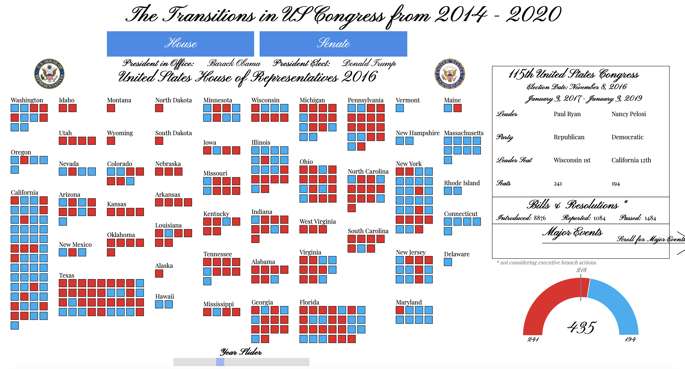
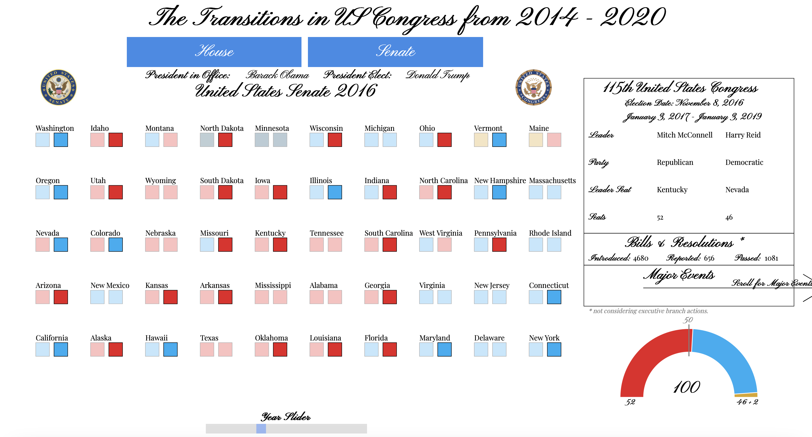
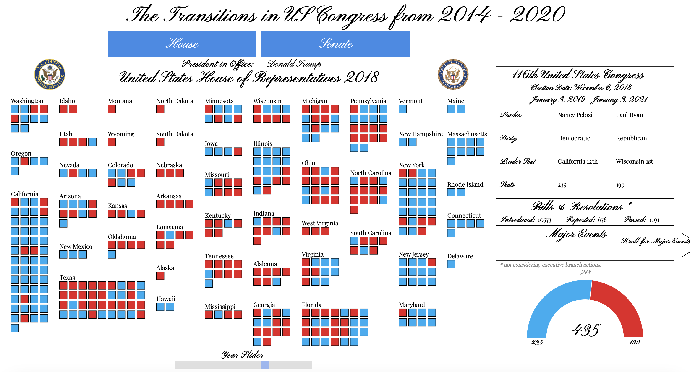
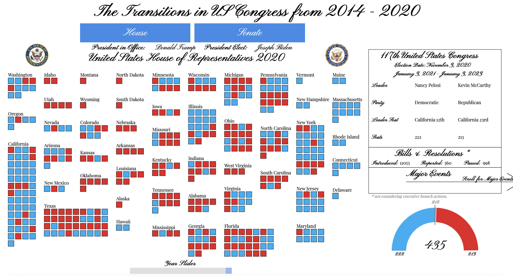

# The Transitions in US Congress from 2014 - 2020

**Contents**
- About
- Dataset
- Scripts
- Interactivity Features
- Outputs
  1. Congress Through 2014 - 2020 
  2. Major Events Through 2014 - 2020

**About** 
This directory contains the dataset, scripts and other resorces for creating an interactive visualization representing the US Congress from the year 2014 to 2020.

Interact with the [Visualization](https://gauravpatil123.github.io/Transitions-in-US-Congress/) yourself

**Datasets** 
- "Data Collection House  - Number of Seats.csv"
This file is a cutom built dataset which contains the number of seats each state represents in the US house of Representatives for different decades based on the census.

- "Data Collection House  - 2014 - 2020.csv"
This is a custom built dataset that contains the data about the US House of Representatives for the years 2014 through 2020. This data includes the election year, state, district number, winning candidates name & winning candidates party.

- "Data Collection Senate - 2014 - 2020.csv"
This is a custom builtdataset that contains data about the US Senate for the years 2014 through 2020. This data includes the election year, state, winning candates, winning candidates party, seat class, current election cycle & special election.

- "CongressDetails.JSON"
This dataset contains information about the leaders of both the houses, the seats won by each party, Major events & statistical data about Bills & Resolution passed in each house of Congress.

I have uploaded the all datasets in the data directory and you can find it here [data/](https://github.com/gauravpatil123/Interactive-Visualizations/tree/main/Transitions%20in%20US%20Congress/data).

**Scripts** 
- index.html 
Running this script on a server will create a interactive visualization representing the composition of the US Congress from 2014 - 2020. This script will create two butoons on the top & a slider at the botton. The user can interact with these features in any order or way he chooses. Moreover, the user can also scroll to the right to explore major events for every election cycle from 2014 - 2020.

- index.js 
This script contains all the code for the interactivity and svg on which the visualization is created upon. The visualization is built using D3.

- index.css 
This css file contails the style sheet for all the elemnent used in the visualization.

**Interactivity Features** 
  1. The seats represented as squares on both the houses of congress have tooltips which can be accessed by hovering over them, these tooltips have information about the seat selected. 
  2. The visualization has two buttons at the top to switch between the two houses of congress.
  3. The slider on bottom goes from year 2014 to 2020 with the increment of 2 year. This can be used to cycle the visualization through the election cycles from the dataset and look at the changes in the visualization in realtime.
  4. The colors chosen for this visualization are colorblind safe. 
  5. The visualization alos has a horizontal scroll feature that can be used to explore Major events that happened during the tenure of the selected Congress.

**Outputs** 
- Congress Through 2014 - 2020 
 &nbsp;&nbsp;&nbsp;  
 &nbsp;&nbsp;&nbsp;  
 &nbsp;&nbsp;&nbsp;  
 &nbsp;&nbsp;&nbsp;  

- Major Events Through 2014 - 2020 
 &nbsp;&nbsp;&nbsp;  
 &nbsp;&nbsp;&nbsp;  
